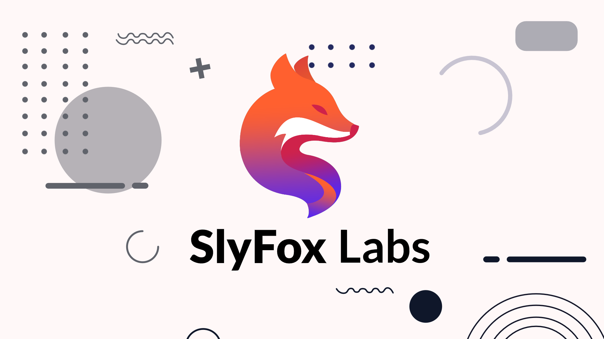

# SlyFox Labs - Sitio Web Frontend



Este es el repositorio del sitio web frontend para SlyFox Labs, una plataforma que ofrece recursos para desarrolladores frontend y diseñadores. El sitio web ha sido desarrollado utilizando Next.js, React, y ShadCN UI.

## ● Características

*   **Múltiples Secciones:**
    *   **About:** Presentación de SlyFox Labs.
    *   **Freacture (Features):** Servicios y tecnologías utilizadas.
    *   **Resource:** Recursos descargables y visualizables.
    *   **Contact:** Información y medios de contacto.
*   **Diseño Responsivo:** Adaptado para una óptima visualización en dispositivos móviles, tablets y escritorio.
*   **Tema Claro/Oscuro:** Selector de tema para mejorar la experiencia del usuario.
*   **Animaciones Sutiles:** Transiciones y animaciones de entrada para una interfaz más dinámica.
*   **Navegación Intuitiva:** Barra de navegación superior e inferior fija con seguimiento de sección activa.
*   **Componentes Reutilizables:** Uso de ShadCN UI para componentes de alta calidad.

## ● Tecnologías Utilizadas

*   **Framework Frontend:** [Next.js](https://nextjs.org/) (con App Router)
*   **Librería UI:** [React](https://reactjs.org/)
*   **Componentes UI:** [ShadCN UI](https://ui.shadcn.com/)
*   **Estilos CSS:** [Tailwind CSS](https://tailwindcss.com/)
*   **Iconos:** [Lucide React](https://lucide.dev/) y SVGs personalizados.

## ● Empezando

Sigue estos pasos para configurar y ejecutar el proyecto localmente.

### Prerrequisitos

*   [Node.js](https://nodejs.org/) (versión 18.x o superior recomendada)
*   [npm](https://www.npmjs.com/) o [yarn](https://yarnpkg.com/)

### Instalación

1.  **Clona el repositorio:**
    ```bash
    git clone https://github.com/Syllkom/SlyFox-Labs.git
    cd SlyFox-Labs
    ```

2.  **Instala las dependencias:**
    ```bash
    npm install
    # o si usas yarn
    # yarn install
    ```

### Ejecutando la Aplicación

Para iniciar el servidor de desarrollo:
```bash
npm run dev
# o si usas yarn
# yarn dev
```
Abre [http://localhost:9002](http://localhost:9002) (o el puerto que hayas configurado) en tu navegador para ver la aplicación.

## ● Despliegue

Este proyecto está optimizado para ser desplegado en plataformas que soporten Next.js.

*   **Vercel:** Altamente recomendado por ser de los creadores de Next.js y ofrecer una integración perfecta. Simplemente conecta tu repositorio de GitHub y Vercel se encargará del resto.
*   **Netlify:** Otra excelente opción con buen soporte para Next.js.

## 📄 Licencia

Consulta el archivo `LICENSE` para más detalles.

---

Desarrollado con ❤️ por Syllkom.
